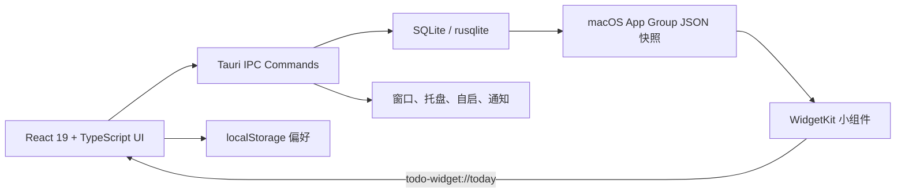

# BluNote v0.2.2 功能说明书

## 1. 文档信息

| 项目 | 内容 |
|---|---|
| 产品名称 | BluNote |
| 基线版本 | v0.2.2 |
| 事实来源 | `main` 分支提交 `60cfd4168792b905107fb61e56bb0d5d671d8967` |
| 基线日期 | 2026-08-21 |
| 当前正式平台 | macOS 13+、Windows 10 21H2+ |
| 文档性质 | 对当前代码已实现行为的说明，不包含 `dev-ql` 分支功能 |

## 2. 产品定位

BluNote 是一个本地优先的轻量桌面任务与会议挂件。它用可常驻桌面的透明小窗口承载日程、待办、子任务和提醒，降低用户在完整项目管理软件与当前工作之间切换的成本。

当前版本面向个人用户，不提供账号、云同步、团队空间、共享任务或遥测。任务数据保存在本机 SQLite 数据库中；macOS 原生小组件通过 App Group 读取本地快照。

## 3. 界面与信息架构

### 3.1 主界面

主界面自上而下由以下区域组成：

1. 顶部栏：品牌、当前日期、位置锁定、窗口展开/收起、更多设置和新增事项。
2. 类型筛选：全部、工作清单、会议，并显示未完成事项数量。
3. 日历：周/月视图切换、前后导航、返回今天、每日事项数量角标。
4. 日程列表：展示选中日期的任务和会议，未完成项优先。
5. 事项详情：备注、地点、会议链接、提醒状态、子任务及删除入口。

### 3.2 窗口形态

| 形态 | 默认尺寸 | 默认日历 | 说明 |
|---|---:|---|---|
| 挂件模式 | 360 × 620 | 从当前选中日期开始的连续 7 天 | 适合桌面常驻 |
| 展开模式 | 900 × 640 | 完整月历 | 左侧日历、右侧事项列表 |

窗口最小尺寸为 340 × 520。窗口无系统标题栏，八个边缘/角落均可鼠标拉伸；顶部栏和顶部拖动区可拖动窗口。

### 3.3 视觉与主题

- macOS 风格圆角、毛玻璃、浅色材质和蓝色强调色。
- 支持系统明暗模式。
- 支持 55%–100% 外观透明度，步长 5%，默认 95%。
- 透明度作用于主挂件，并同步至 macOS WidgetKit 快照。

## 4. 功能清单

### 4.1 日历与日期导航

- 挂件默认显示连续 7 天，第一天是当前日期，不是固定自然周周一。
- 月视图以周一为每周第一天，并补齐月初、月末相邻日期。
- 点击日期切换当日日程；点击日历标题回到今天。
- 周视图按 7 天前后移动，月视图按自然月前后移动。
- 挂件和展开窗口分别保存周/月视图偏好。
- 日期角标最多显示数字 9；超过 9 项仍显示 9。

### 4.2 任务管理

新建任务支持：

| 字段 | 规则 |
|---|---|
| 标题 | 必填，最长 160 字符 |
| 日期 | 作为任务截止日，内部保存为当日 23:59:59 |
| 任务提醒 | 可选，精确到分钟 |
| 备注 | 可选，最长 4000 字符 |
| 子任务 | 可添加多个，每项标题最长 160 字符 |
| 子任务计划时间 | 可选，不得晚于父任务截止日 |

任务操作：

- 标记父任务完成时，所有子任务同步完成。
- 将父任务恢复为未完成时，不自动恢复子任务状态。
- 子任务可独立完成；所有子任务完成后父任务自动完成。
- 展示子任务完成进度条。
- 超过截止日期且未完成的任务标记为“已逾期”。
- 支持删除，删除前弹出不可撤销确认。
- 当前版本不支持编辑已创建事项、复制、批量操作、优先级、标签和重复任务。

### 4.3 会议管理

新建会议支持：

| 字段 | 规则 |
|---|---|
| 标题 | 必填，最长 160 字符 |
| 日期和开始时间 | 必填，默认 09:30 |
| 结束时间 | 默认 10:00，必须晚于开始时间 |
| 地点 | 可选，最长 200 字符 |
| 会议链接 | 可选，仅允许 HTTP/HTTPS |
| 提前提醒 | 5、15、30、60 分钟，默认 15 分钟 |
| 备注 | 可选，最长 4000 字符 |

会议详情支持直接打开会议链接。会议超过开始日期且未完成时会显示逾期状态；当前版本不支持编辑、重复会议、参会人或会议纪要模板。

### 4.4 筛选、排序与计数

- 可按全部、任务、会议筛选选中日期的事项。
- 顶部计数只统计全局未完成任务/会议，不是选中日期数量。
- 日程标题显示选中日期当前筛选后的总项目数，包含已完成项。
- 排序规则：未完成优先，其次按任务截止/会议开始时间升序，再按创建时间倒序。

### 4.5 任务提醒与稍后提醒

任务提醒状态机：`none → pending → fired → snoozed → fired`。

- 前端每 30 秒扫描一次到期任务。
- 到期任务触发系统通知并进入“已提醒”状态。
- 通知支持 30 分钟后、1 小时后、明天 09:00、自定义四种处理。
- 同一自然日最多稍后提醒 3 次，跨日自动重新计数。
- 点击默认通知动作或自定义入口会显示主窗口、定位到任务并展开详情。
- 已完成任务不会触发提醒。

边界：提醒依赖应用进程和 WebView 运行；系统休眠后任务提醒会在恢复扫描时补发，但尚无操作系统级持久调度。

### 4.6 会议提醒

- 前端每 30 秒检查会议提醒时间。
- 首次需要时请求系统通知权限。
- 通知标题为“即将开始 · 会议标题”，正文优先显示地点。
- 发送后写入 `reminderSentAt`，防止重复通知。

边界：有效触发窗口从预定提醒时间持续至会议开始后 1 分钟。设备长时间休眠并越过该窗口时可能漏发。

### 4.7 ICS 日历导入

- 支持本地选择 `.ics` 文件，文件最大 5 MB。
- 解析 `VEVENT` 中的 UID、标题、描述、开始/结束时间、地点和 URL。
- 缺少标题或开始时间的事件被忽略。
- 导入会议默认提前 15 分钟提醒。
- 会议 URL 仅保留 HTTP/HTTPS，其他协议被清空。
- 标题、描述、地点按应用字段上限截断。
- 以 `ics:<UID>` 作为稳定 ID；再次导入相同 UID 会覆盖本地同 ID 项。
- 导入项显示“已导入”标识，但导入后仍可完成或删除。

当前不支持 ICS 导出、订阅 URL、增量刷新、时区参数完整解析和系统日历账户直连。

### 4.8 桌面挂件与窗口控制

- 桌面小组件模式将窗口置于普通窗口下方并隐藏任务栏入口。
- 开启桌面小组件时，展开窗口自动收回挂件尺寸。
- 可锁定位置；锁定后阻止应用内拖动。
- 窗口距离屏幕工作区边缘 8 px 时自动吸附。
- 移动和缩放后 500 ms 保存位置与尺寸。
- 多显示器下按当前显示器工作区约束位置和尺寸，避免窗口完全移出可视范围。
- 关闭窗口只隐藏应用；托盘菜单可重新显示或退出。
- 单实例运行，第二次启动会唤起现有窗口。

### 4.9 展开模式侧栏

- 展开窗口中的侧栏宽度支持鼠标拖动。
- 宽度范围 220–380 px，默认 286 px。
- 键盘聚焦分隔条后，可用左右方向键每次调整 10 px。
- 宽度保存在本机偏好中。

### 4.10 托盘与开机自启

托盘菜单包括：显示 BluNote、锁定位置、退出 BluNote。位置锁定状态会在托盘与主窗口之间同步。

更多设置中可开启或关闭开机自启。当前代码向自启插件传递 `--silent`，但没有处理该参数的专门启动流程，需在后续版本验证是否真正静默启动。

### 4.11 macOS 原生 WidgetKit 小组件

- 支持系统小尺寸和中尺寸。
- 展示今天未完成任务和最近一场会议。
- 小尺寸最多 3 个任务，中尺寸最多 5 个任务。
- 没有事项时显示“今天没有待办”。
- 每 60 秒生成一次时间线刷新计划。
- 点击小组件通过 `todo-widget://today` 打开主应用并定位到今天。
- 通过 App Group `group.com.todo.desktop` 读取原子写入的 `todo-widget.json`。

该功能只适用于 macOS；Windows 在当前版本没有操作系统原生小组件。

## 5. 本地数据与偏好

### 5.1 事项数据模型

| 字段组 | 主要字段 |
|---|---|
| 身份 | `id`、`type`、`source` |
| 内容 | `title`、`notes`、`location`、`meetingUrl` |
| 时间 | `startAt`、`endAt`、`dueAt`、`createdAt`、`updatedAt` |
| 会议提醒 | `reminderMinutes`、`reminderSentAt` |
| 任务提醒 | `reminderAt`、`reminderStatus`、`snoozeCount`、`lastReminderAt` |
| 状态 | `completed` |
| 子任务 | `subtasks[]`：ID、标题、完成状态、计划时间 |

桌面应用将完整事项保存为 JSON，同时把 ID、更新时间和提醒检索字段写入 SQLite。单条 JSON 上限为 65,535 字节，所有 SQL 使用参数绑定。

### 5.2 数据库

- 文件：操作系统应用数据目录下的 `todo.db`。
- 主键：事项 ID。
- 写入：使用 UPSERT，创建与更新共用同一接口。
- 数据库版本：`user_version = 2`。
- v1 → v2 迁移会保留旧 payload 并补充提醒字段。
- 浏览器测试/预览环境使用 `localStorage` 的 `todo.items.v1` 作为回退。

### 5.3 本地偏好键

| 键 | 用途 |
|---|---|
| `todo.appearanceOpacity` | 外观透明度 |
| `todo.calendarView.widget` | 挂件日历视图 |
| `todo.calendarView.expanded` | 展开模式日历视图 |
| `todo.positionLocked` | 位置锁定 |
| `todo.edgeSnap` | 边缘吸附 |
| `todo.desktopWidget` | 桌面小组件模式 |

## 6. 技术架构

| 层 | 技术 |
|---|---|
| UI | React 19、TypeScript、Vite、date-fns、Lucide |
| 桌面容器 | Tauri 2 |
| 原生逻辑 | Rust |
| 存储 | SQLite / rusqlite bundled |
| 系统能力 | Tauri autostart、notification、single-instance、window-state |
| macOS 小组件 | SwiftUI、WidgetKit、App Group |
| 安装包 | macOS DMG、Windows NSIS |

## 7. 安全与隐私

- 无账号、无服务端、无遥测，数据默认不离开本机。
- CSP 默认只允许本地资源、Tauri IPC 和必要的内联样式。
- Tauri capability 仅开放主窗口需要的窗口、通知、自启和窗口状态权限。
- 会议链接限定 HTTP/HTTPS。
- ICS 不执行脚本或附件，且有文件大小和字段长度上限。
- 外部文本按 React 默认转义渲染，不使用 `dangerouslySetInnerHTML`。
- SQLite 使用参数绑定，payload 同时验证 JSON 格式和 ID 一致性。

## 8. 自动化测试与构建

- 前端共 29 项测试，覆盖主界面、任务完成联动、日历、ICS、提醒、存储迁移和输入校验。
- Rust 共 4 项测试，覆盖数据库迁移、8 px 吸附和屏幕范围约束。
- CI 执行 npm 可复现安装、依赖审计、ESLint、Vitest、TypeScript/Vite 构建、Rustfmt、Clippy、Cargo Audit。
- macOS 原生构建会生成并嵌入 WidgetKit 扩展；Windows 构建 NSIS 安装包。

## 9. 当前明确缺口

| 优先级 | 缺口/风险 | 影响 |
|---|---|---|
| 高 | 已创建事项不能编辑 | 用户必须删除重建，容易丢失状态 |
| 高 | 提醒依赖前端轮询 | 休眠、WebView 挂起时存在漏发风险 |
| 高 | 正式签名、公证尚未配置 | 安装信任与正式分发受阻 |
| 高 | 没有数据备份、导出和恢复 | 设备迁移或数据库损坏时不可恢复 |
| 中 | 无搜索、优先级、标签、重复任务 | 事项增多后管理效率下降 |
| 中 | ICS 时区和订阅能力有限 | 复杂日历可能产生时间偏差，不能自动同步 |
| 中 | 开机自启静默参数未闭环 | 登录后可能意外显示窗口 |
| 中 | Windows 无原生系统小组件 | 与 macOS 平台能力不一致 |

## 10. 发布状态

v0.2.2 已实现核心本地任务、会议、提醒、桌面挂件和 macOS WidgetKit 能力。正式生产发布仍需完成 Apple Developer ID 签名与公证、Windows Authenticode 签名、App Group 正式配置、真机通知长稳测试、多显示器热插拔测试和无障碍复核。
