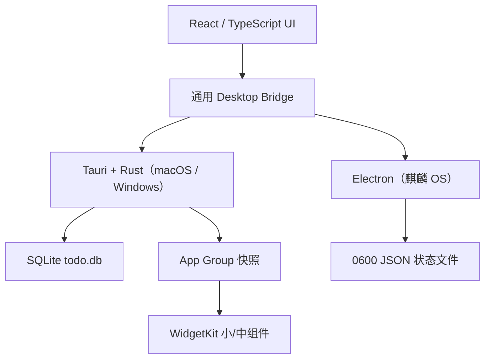

# BluNote v1.0 产品需求文档（持续维护版）

| 项目 | 内容 |
|---|---|
| 文档类型 | 产品需求文档（PRD）与迭代台账 |
| 目标版本 | v1.0 |
| 需求文档版本 | v1.0-r4 |
| 当前开发基线 | `dev` / v0.3.1 |
| 当前稳定基线 | `main` / v0.2.4 / `ca9592b` |
| 目标平台 | macOS、Windows、银河麒麟桌面操作系统 V10 SP1 2503 |
| 文档状态 | Living Document |
| 首次整理 | 2026-08-18 |
| 本次更新 | 2026-08-27 |

> 状态定义：**已实现**表示代码基线已具备；**部分实现**表示已有基础能力但仍存在发布差距；**待实现**表示 v1.0 规划需求；**工程约束**表示后续开发必须持续遵守。

## 1. Executive Summary

### Problem Statement

BluNote 是一款本地优先的桌面待办与会议挂件。产品已经经历窗口交互、日历、提醒、原生小组件、跨平台安装、视觉与品牌、布局体验、兼容性和工程治理等多轮迭代，但需求分散在对话、历史文档与提交记录中，缺少一份能同时回答“当前已经有什么、尚缺什么、每次为何改变、如何验收”的统一需求基线。

当前主要问题包括：三套桌面运行环境的数据实现尚未完全统一；提醒仍依赖应用运行时轮询；macOS 正式签名、公证与多架构分发尚未闭环；Windows 最新版本安装包需要补齐；WidgetKit 需要完整 Xcode 与签名环境验证；搜索、重复计划、备份恢复等高频效率能力尚未实现。

### Proposed Solution

以 dev v0.3.1 为当前开发基线，持续建设一个简洁、可拖拽、可缩放、可调整透明度和字体大小的桌面任务与会议中心。v1.0 在保留轻量挂件体验的同时，完成任务全生命周期、可靠提醒、搜索整理、重复计划、备份恢复、三平台一致性和可发布安装链路。本地离线使用是默认能力，账号、云同步和团队协作不进入 v1.0。

### Success Criteria

| 指标 | v1.0 验收目标 | 验证方式 |
|---|---:|---|
| P0 功能 | 验收用例通过率 100% | CI 与三平台手工回归 |
| 冷启动 | p95 ≤ 2 秒 | 各平台基准机从启动到可交互 |
| 窗口可用性 | 100% 可拖动、缩放且不会永久移出可视区 | 多显示器、缩放比例与休眠恢复测试 |
| 数据可靠性 | 升级、迁移、备份和恢复 100% 无数据丢失 | 固定数据集与故障注入 |
| 提醒可靠性 | 常驻状态触达率 ≥ 99%，休眠恢复后 60 秒内补偿 | 1000 组自动化与真机场景 |
| 搜索性能 | 10,000 条数据下 p95 ≤ 200 ms | 本地基准测试 |
| 稳定性 | 72 小时长稳测试无 P0/P1 缺陷 | 三平台真机测试 |
| 安装成功率 | 支持范围内设备 100% 安装并首次启动 | 安装、升级、卸载矩阵 |
| 安全质量 | 无已知高危漏洞，核心领域逻辑覆盖率 ≥ 90% | 依赖审计与覆盖率报告 |

## 2. User Experience & Functionality

### User Personas

1. **桌面重度工作者**：希望待办常驻桌面，在不打断当前工作的前提下快速记录、查看和完成事项。
2. **会议密集型用户**：需要管理会议时间、链接、地点与提醒，并从标准日历文件导入日程。
3. **隐私敏感用户**：不希望注册账号或上传工作数据，要求离线可用、数据可备份和恢复。
4. **跨系统用户**：使用 macOS、Windows 或麒麟 OS，希望核心能力和交互语义一致。

### User Stories

#### US-01 紧凑与展开视图（P0，已实现）

As a 桌面用户, I want to 在紧凑挂件和完整工作区之间切换 so that 不同工作状态下都能高效使用。

Acceptance Criteria:

- 紧凑态默认尺寸为 360 × 620，优先展示今日信息和快捷操作。
- 展开态默认尺寸为 900 × 640。
- 展开态采用左右 50% 布局，待办/会议列表位于左侧，日历位于右侧。
- 待办区域内容超出高度时可以独立上下滚动，日历不随之滚动。
- 冷启动直接使用正确缩放与布局，不要求用户先展开再缩小才能恢复。
- 切换状态时不得丢失筛选、滚动位置和未保存输入。

#### US-02 窗口拖动、缩放与可视范围（P0，已实现）

As a 桌面用户, I want to 自由移动和调整挂件大小 so that 它能适应我的桌面布局。

Acceptance Criteria:

- 可通过明确的非交互区域拖动主窗口，按钮、输入框和列表操作不误触拖动。
- 支持四边和四角共八方向缩放，并满足最小尺寸约束。
- 移动和缩放后窗口始终保留在当前屏幕工作区可见范围内。
- 支持 8px 屏幕边缘吸附、窗口位置锁定和恢复默认布局。
- 显示器断开、分辨率或缩放比例变化后，窗口自动纠正到可见区域。
- macOS、Windows、麒麟 OS 的能力一致；受 Wayland 限制时必须明确告知用户。

#### US-03 日历浏览（P0，已实现）

As a 用户, I want to 按周和按月浏览日期 so that 能快速定位任务与会议。

Acceptance Criteria:

- 支持周视图和月视图切换。
- 每周固定按周一为第一天、周日为最后一天排列。
- 月视图使用完整周网格补齐月初和月末日期。
- 支持上一周期、下一周期、回到今天和日期选择。
- 日期上展示任务与会议状态提示；切换日期后列表同步更新。

#### US-04 任务全生命周期（P0，已实现）

As a 用户, I want to 创建、查看、编辑、完成和删除任务 so that 能持续维护真实计划。

Acceptance Criteria:

- 创建任务时至少包含非空标题，并可配置日期、时间、备注和提醒。
- 已创建任务提供编辑入口，保存后立即更新列表、日历与持久化数据。
- 支持完成与取消完成；完成状态在重启后保持。
- 删除为明确用户操作，并避免误触。
- 输入长度、日期时间关系和非法值需要校验。
- 编辑保留记录 ID 与创建时间，并更新 `updatedAt`。

#### US-05 子任务与进度（P0，已实现）

As a 用户, I want to 将任务拆分为子任务 so that 能跟踪复杂事项的完成进度。

Acceptance Criteria:

- 支持新增、编辑、完成、取消完成和删除子任务。
- 展示已完成数、总数和进度。
- 父任务与子任务的完成联动遵循一致规则，不产生循环更新。
- 子任务变更即时持久化，重启后完整恢复。

#### US-06 会议管理（P0，已实现）

As a 用户, I want to 创建和继续编辑会议 so that 时间或参会信息变化时无需删除重建。

Acceptance Criteria:

- 会议支持标题、日期、开始/结束时间、备注、地点、会议链接和提醒。
- 已创建会议提供编辑入口，修改后立即同步列表、日历与持久化数据。
- 结束时间不得早于开始时间；会议链接只接受允许的协议。
- 支持删除会议和打开有效会议链接。
- 编辑会议不改变原记录 ID。

#### US-07 筛选、排序与计数（P0，已实现）

As a 用户, I want to 聚焦不同类型的事项 so that 当前视图保持清晰。

Acceptance Criteria:

- 支持全部、任务、会议三种筛选。
- 筛选标签展示对应数量，并随数据变化即时更新。
- 同一日期内按开始时间、类型和稳定次序排序。
- 空状态、加载状态和错误状态有明确反馈。

#### US-08 任务提醒与稍后提醒（P0，部分实现）

As a 用户, I want to 在合适时间收到提醒并可稍后处理 so that 不遗漏重要事项。

Acceptance Criteria:

- 已实现提前 30 分钟、提前 1 小时、次日 9:00 和自定义提醒。
- 已实现系统通知权限请求、到期检测和通知点击回到应用。
- 已实现每日最多 3 次稍后提醒限制。
- v1.0 必须改为操作系统级可靠调度，应用非前台或短暂退出后仍按平台能力工作。
- 休眠、时区变化和重启后不得重复提醒，错过的提醒应在 60 秒内补偿。
- 修改或删除事项后必须同步取消旧调度并创建新调度。

#### US-09 会议提醒（P0，部分实现）

As a 会议用户, I want to 在会议开始前收到可靠通知 so that 能准时加入。

Acceptance Criteria:

- 已实现应用运行期间的会议提醒轮询。
- 提醒内容包含会议标题、开始时间，并在存在有效链接时提供进入路径。
- v1.0 必须与任务提醒共享可靠调度、去重、补偿和权限处理机制。
- 会议编辑、删除或导入更新后必须同步调度状态。

#### US-10 ICS 日历文件（P1，部分实现）

As a 用户, I want to 导入和导出标准日历文件 so that 能与外部日历交换会议信息。

Acceptance Criteria:

- 已实现 `.ics` 文件导入和基础字段解析。
- 导入前展示解析结果、异常项和即将写入的数量。
- 以 UID 和时间范围识别重复项，不静默覆盖本地编辑。
- v1.0 增加选中会议或日期范围的 ICS 导出。
- 不支持的重复规则或时区必须给出可理解提示。

#### US-11 外观、透明度与桌面模式（P0，已实现）

As a 用户, I want to 调整挂件外观 so that 它能融入 macOS 风格及不同桌面背景。

Acceptance Criteria:

- 保持简约、轻量、低干扰的原生桌面审美，三平台结构和视觉语言基本一致。
- 支持 55%–100% 外观透明度调整，并即时预览和持久化。
- 支持桌面挂件模式、置顶状态和窗口锁定。
- 文本与关键控件在最低透明度下仍满足可读性要求。
- 系统深浅色、减少动态效果和高对比度设置应得到合理响应。

#### US-12 托盘、自启动与单实例（P1，部分实现）

As a 桌面用户, I want to 让应用常驻并避免重复启动 so that 提醒和快速访问更可靠。

Acceptance Criteria:

- 已具备托盘、开机自启动和单实例基础能力。
- 点击托盘图标可显示、隐藏或聚焦已有窗口。
- 重复启动不得创建第二份数据写入实例。
- 自启动开关需要用户可控，默认策略在三平台保持一致并有说明。
- 退出与关闭窗口的语义必须明确，不能导致用户误以为提醒仍在运行。

#### US-13 macOS 原生小组件（P1，部分实现）

As a macOS 用户, I want to 将 BluNote 添加到系统小组件区域 so that 不打开主窗口也能查看任务。

Acceptance Criteria:

- 已提供 WidgetKit 小尺寸和中尺寸源码与 App Group 快照桥接。
- 小组件外形与主应用风格一致，显示今日事项与完成状态摘要。
- 点击小组件通过深链接打开主应用对应页面。
- 正式发布前必须在完整 Xcode、有效签名和 App Group 权限环境下完成构建与真机验证。
- Windows 与麒麟 OS 不要求仿制 WidgetKit，但桌面挂件核心能力必须保留。

#### US-14 品牌、名称与图标（P0，已实现）

As a 用户, I want to 在所有触点看到一致的 BluNote 品牌 so that 能正确识别应用。

Acceptance Criteria:

- 应用显示名称统一为 BluNote。
- 主应用、Dock、任务栏、托盘、窗口、安装器和系统小组件均使用最新蓝色便笺图标资源。
- 构建前清理旧图标缓存与生成物，安装升级后不得继续显示过期图标。
- 安装包元数据、关于页面和通知来源显示一致名称。
- 内部代码命名保持产品无关，产品名称仅用于用户界面、安装产物和文档。

#### US-15 本地数据、隐私与迁移（P0，部分实现）

As a 隐私敏感用户, I want to 数据默认只保存在本机 so that 不依赖账号或云服务也能使用。

Acceptance Criteria:

- macOS 与 Windows 当前使用 SQLite `todo.db`；浏览器降级环境使用 `todo.*` 本地键。
- 麒麟 OS 当前使用权限为 `0600` 的 JSON 状态文件。
- 应用不要求登录，不默认上传任务、会议或使用数据。
- 已包含历史存储标识向通用标识迁移的兼容逻辑，迁移可重复执行且不丢数据。
- v1.0 需要统一逻辑数据模型、版本化迁移和可验证的跨运行时导入路径。
- 数据文件损坏时不得静默覆盖，应保留原文件并引导恢复。

#### US-16 三平台安装与升级（P0，部分实现）

As a 跨平台用户, I want to 点击安装包即可安装和启动 so that 不需要使用命令行。

Acceptance Criteria:

- macOS 提供 DMG；Windows 提供图形化安装包；麒麟 OS 提供双击安装的 DEB。
- 当前 macOS v0.3.1 为 Apple Silicon 本地/临时签名构建，其他设备正式分发仍需 Developer ID 签名与公证。
- Windows 已存在 v0.2.2 安装产物，必须补齐与当前功能一致的最新版构建和验证。
- 麒麟 OS v0.2.4 自包含 Electron 运行时，不依赖 `libwebkit2gtk-4.1-0`，支持银河麒麟 V10 SP1 2503 与 Hygon C86 x86_64。
- 安装、覆盖升级、保留数据、卸载和重新安装均纳入测试矩阵。
- 安装包明确标注架构；Apple Silicon 与 Intel Mac 不得混淆，必要时提供 universal 或分别提供 arm64/x64。

#### US-17 搜索、优先级、标签与聚合视图（P0，待实现）

As a 事项较多的用户, I want to 检索和分类 so that 能在数秒内找到目标内容。

Acceptance Criteria:

- 支持搜索标题、备注、地点和子任务文本。
- 支持高、中、低、无四档优先级与自定义标签。
- 支持今天、即将到来、已完成和全部四类聚合视图。
- 支持类型、日期范围、完成状态、优先级和标签组合筛选。
- 10,000 条数据下查询 p95 ≤ 200 ms，结果稳定且匹配内容可识别。

#### US-18 重复任务与重复会议（P0，部分实现）

As a 有固定节奏的用户, I want to 设置重复规则 so that 周期性工作无需反复创建。

Acceptance Criteria:

- 已实现新增任务时选择单日，或从指定日期起选择每周一个或多个星期重复。
- 每周模式筛选条宽度为 180px，星期按钮为 30 × 30px；在紧凑窗口中不得横向溢出。
- 每周任务仅保存一条重复规则，不预生成未来记录；每个出现日期可独立标记完成。
- 已实现每周事项在主日历与 macOS 小组件中的日期识别，旧数据无需迁移即可继续使用。
- 待实现每天、工作日、每月和自定义间隔，以及重复会议。
- 支持永不结束、指定结束日期和指定次数。
- 完成当前实例后生成下一实例，历史实例保持可追溯。
- 编辑或删除可选择仅本次、本次及以后或整个系列。
- 月末采用当月最后有效日策略；跨夏令时保持用户选择的本地时间。

#### US-19 备份、恢复与通用导出（P0，待实现）

As a 用户, I want to 备份并恢复数据 so that 设备迁移或异常不会造成损失。

Acceptance Criteria:

- 支持手动导出版本化、可校验的完整备份文件。
- 支持从受支持版本恢复，执行前展示范围并自动生成恢复前快照。
- 支持 JSON 或 CSV 通用导出；会议另支持 ICS 导出。
- 导入冲突提供预览、跳过、合并或复制策略，不静默覆盖。
- 损坏、来源不可信或未来版本文件必须安全拒绝并提供原因。

#### US-20 设置、首次引导与诊断（P1，待实现）

As a 新用户, I want to 理解权限和关键操作 so that 能顺利完成首次使用并自行排查问题。

Acceptance Criteria:

- 首次引导说明创建任务、切换视图、拖动窗口和通知授权。
- 设置页集中管理透明度、置顶、桌面模式、自启动、通知和数据工具。
- 通知被拒绝时展示可操作的系统设置入口。
- 支持导出不包含任务正文的诊断信息，且必须由用户主动触发。
- 提供恢复默认窗口位置和外观设置，不删除业务数据。

#### US-21 字体大小与设置栏交互（P1，已实现）

As a 桌面用户, I want to 调整字体并让设置栏自动收起 so that 阅读更舒适且不需要重复点击关闭。

Acceptance Criteria:

- 设置栏使用四档滑杆调节字体；第 1 档为原标准字号 100%，第 2–4 档依次为 115%、130%、145%。
- 滑杆按整数档位吸附，并同时展示当前档位与百分比。
- 字体大小作用于主界面、事项卡片、日历、设置栏和新增/编辑表单，并即时生效。
- 字体设置保存到本机，应用重启后保持。
- 点击设置栏内部不会关闭；点击设置栏与触发按钮之外的任意界面位置时自动收起。
- 设置项均即时保存，自动收起不会丢失更改。

### Functional Requirement Matrix

| ID | 功能需求 | 优先级 | 当前状态 | v1.0 发布差距 |
|---|---|---:|---|---|
| FR-001 | 紧凑/展开双视图 | P0 | 已实现 | 补充跨平台视觉回归 |
| FR-002 | 展开态左右 50% 布局与列表滚动 | P0 | 已实现 | 补充不同尺寸回归 |
| FR-003 | 窗口拖动、八向缩放、锁定、吸附和可视边界 | P0 | 已实现 | 多屏与 Wayland 验证 |
| FR-004 | 冷启动正确缩放 | P0 | 已实现 | 多缩放比例真机验证 |
| FR-005 | 周/月日历与周一至周日规则 | P0 | 已实现 | 时区边界回归 |
| FR-006 | 任务 CRUD 与继续编辑 | P0 | 已实现 | 完善未保存变更保护 |
| FR-007 | 子任务与进度联动 | P0 | 已实现 | 完善大数据量测试 |
| FR-008 | 会议 CRUD 与继续编辑 | P0 | 已实现 | 完善字段校验 |
| FR-009 | 类型筛选、排序与计数 | P0 | 已实现 | 增加组合筛选 |
| FR-010 | 任务提醒与稍后提醒 | P0 | 部分实现 | 操作系统级调度、补偿、去重 |
| FR-011 | 会议提醒 | P0 | 部分实现 | 与统一调度器整合 |
| FR-012 | ICS 导入 | P1 | 已实现 | 冲突预览与高级规则 |
| FR-013 | ICS 导出 | P1 | 待实现 | 全量实现 |
| FR-014 | 透明度、桌面模式、置顶与锁定 | P0 | 已实现 | 可访问性验证 |
| FR-015 | 托盘、自启动与单实例 | P1 | 部分实现 | 三平台语义与回归 |
| FR-016 | WidgetKit 小/中组件 | P1 | 部分实现 | 正式签名和真机验证 |
| FR-017 | BluNote 名称与最新图标全触点统一 | P0 | 已实现 | 安装升级缓存回归 |
| FR-018 | 本地持久化与历史数据迁移 | P0 | 部分实现 | 统一模型和跨运行时迁移 |
| FR-019 | macOS DMG | P0 | 部分实现 | 签名、公证、arm64/x64 策略 |
| FR-020 | Windows 图形安装包 | P0 | 部分实现 | 生成当前版本并真机测试 |
| FR-021 | 麒麟 OS 自包含 DEB | P0 | 已实现 | 指定真机完整验收 |
| FR-022 | 搜索、优先级、标签和聚合视图 | P0 | 待实现 | 全量实现 |
| FR-023 | 重复任务与会议 | P0 | 部分实现 | 已完成每周任务多选日期；补齐其他周期、结束条件和会议重复 |
| FR-024 | 备份、恢复和通用导出 | P0 | 待实现 | 全量实现 |
| FR-025 | 设置、首次引导和诊断 | P1 | 待实现 | 全量实现 |
| FR-026 | 四档字体滑杆调节与持久化 | P1 | 已实现 | 已完成 100%/115%/130%/145%；补充三平台视觉回归 |
| FR-027 | 点击设置栏外部自动收起 | P1 | 已实现 | 补充键盘交互回归 |

### Iteration History

下表记录截至 2026-08-27 的全部已知需求迭代。相同主题的追问和缺陷复测保留为独立条目，以便追踪需求演进。

| 迭代 | 日期/阶段 | 用户目标 | 形成的产品或工程要求 | 关联需求 | 状态 |
|---|---|---|---|---|---|
| I-001 | 初始版本 | 开发 Windows/macOS 桌面 Todo，参考 Microsoft To Do 与 macOS 简约审美 | 建立桌面挂件、任务基础能力和 GitHub 项目 | FR-001、FR-006 | 已完成 |
| I-002 | 初始交付 | 检查 GitHub 配置并完成严格上线前测试 | 建立版本库、构建、测试与风险检查流程 | 发布门禁 | 持续执行 |
| I-003 | 视觉迭代 | 参考 macOS 设计美学优化外观 | 统一圆角、层级、间距、材质与低干扰视觉 | FR-014 | 已完成 |
| I-004 | 分发迭代 | 更新 macOS DMG | 建立 macOS 安装产物生成流程 | FR-019 | 部分完成 |
| I-005 | 小组件迭代 | 参考原生小组件，支持桌面模式和外观透明度 | 增加桌面挂件模式与 55%–100% 透明度 | FR-014、FR-016 | 已完成/部分完成 |
| I-006 | v0.2 | 支持自由移动、周/月日历、稍后提醒和原生小组件 | 扩展窗口、日历、提醒与 WidgetKit 能力 | FR-003、FR-005、FR-010、FR-016 | 部分完成 |
| I-007 | 严重缺陷 | 主窗口及内部面板可拖动、边缘拉伸且保持可见；刷新全部图标 | 建立八向缩放、边界约束与图标缓存清理 | FR-003、FR-017 | 已完成 |
| I-008 | 缺陷复测 | 可拉伸但仍无法拖动 | 修复拖动命中区域和原生窗口拖动链路 | FR-003 | 已完成 |
| I-009 | 品牌迭代 | 全部图标替换为蓝色便笺图标并更名 BluNote | 统一显示名称、图标、安装器和通知品牌 | FR-017 | 已完成 |
| I-010 | Windows | 生成 Windows 安装包 | 增加 Windows 图形化安装产物 | FR-020 | 旧版完成，当前版待补 |
| I-011 | 分支治理 | main 保持最新发布代码，仅保留 main/dev，后续先在 dev 开发 | 建立 dev 开发、用户批准后合并 main 的治理规则 | 工程约束 | 持续执行 |
| I-012 | 麒麟适配 | 建立麒麟适配分支并达到接近 macOS 的运行效果 | 引入麒麟桌面运行环境与安装链路 | FR-021 | 已完成基础适配 |
| I-013 | 文档化 | 从 main 生成完整功能文档和 v1.0 需求文档 | 建立产品说明与规划基线 | 本文档 | 已完成 |
| I-014 | 麒麟安装 | 提供免命令行、双击即安装的麒麟安装包 | 采用 DEB 图形安装流程 | FR-021 | 已完成 |
| I-015 | 麒麟兼容 | 修复 `libwebkit2gtk-4.1-0` 依赖失败，适配银河麒麟 V10 SP1 2503/Hygon C86 | 改为自包含 Electron 运行时的 x86_64 DEB | FR-021 | 已完成，待真机最终验收 |
| I-016 | macOS 兼容 | 解释 Intel/ARM 差异并调查其他 ARM Mac 安装后打不开 | 安装包必须标注架构，正式分发需签名和公证 | FR-019 | 部分完成 |
| I-017 | 展开布局 | 修复待办列表无法滚动并提高待办区域占比 | 列表独立滚动，改善待办可用面积 | FR-002 | 已完成 |
| I-018 | 布局调整 | 交换展开态日历与待办位置 | 待办/会议在左，日历在右 | FR-002 | 已完成 |
| I-019 | 编辑与布局 | 支持继续编辑事项及会议，展开态左右各 50% | 补齐任务/会议编辑闭环和等宽布局 | FR-002、FR-006、FR-008 | 已完成 |
| I-020 | 交付约定 | 每次新功能开发完成后自动生成 DMG | 功能迭代默认附带 DMG；文档、解释或用户明确豁免时除外 | 发布门禁 | 持续执行 |
| I-021 | 启动缺陷 | 修复每次打开需展开再缩小才能恢复的缩放问题 | 冷启动按当前窗口状态完成首帧布局 | FR-004 | 已完成 |
| I-022 | 日历规则 | 周一为第一天，周日为最后一天 | 固化全局周起始规则 | FR-005 | 已完成 |
| I-023 | 发布整理 | dev 合并 main 并清除 main 无用文件 | 发布前清理与分支同步 | 发布门禁 | 已完成当次操作 |
| I-024 | 项目说明 | 梳理 main、生成 README 并复制到 dev | 更新开发、使用和分发说明 | 文档治理 | 已完成 |
| I-025 | 本地清理 | 仅保留最新安装包，清理无用文件和旧品牌文档 | 减少过期产物与历史品牌残留 | 工程约束 | 已完成当次清理 |
| I-026 | 内部重构 | dev 中旧内部名称统一更名，后续代码不得体现具体 App 名称 | 业务代码使用产品无关命名，兼容逻辑集中隔离 | 工程约束 | 已完成并持续执行 |
| I-027 | 合并授权 | dev 推送 main，本次不生成 DMG | 当次获得 main 合并授权与 DMG 豁免 | 分支治理 | 已完成 |
| I-028 | 麒麟 v0.2.4 | 根据既定要求在 dev 生成麒麟安装包 | 产出自包含 Electron x86_64 DEB | FR-021 | 已完成构建，待指定真机验收 |
| I-029 | 需求治理 | 在上一份说明书上记录每次迭代并覆盖所有功能需求 | 将本文升级为持续维护型 PRD 与需求追踪矩阵 | 本文档 | 已完成 |
| I-030 | 发布治理 | 后续推送至 main 的功能需求变更都要更新需求文档，并记录更新时间和版本 | 将需求文档更新设为功能发布的强制前置条件 | 本文档、发布门禁 | 已生效 |
| I-031 | v0.3.0 | 新增待办支持单日或每周一个/多个星期；设置支持字体大小；点击外部自动收起设置栏 | 增加每周任务规则与按日完成记录、三级字体持久化、设置栏外部点击检测 | FR-023、FR-026、FR-027 | dev 已实现，待发布验证与 main 批准 |
| I-032 | v0.3.1 | 缩小每周重复筛选 UI；字体改为以当前标准字号起步的四档滑杆，拉开档位差异 | 每周筛选条收窄、星期按钮缩至 30px；字体档位调整为 100%/115%/130%/145% 并兼容旧偏好 | FR-023、FR-026 | dev 已实现，待发布验证与 main 批准 |

### Document Revision History

| 文档版本 | 更新时间 | 对应应用版本 | 变更摘要 |
|---|---|---|---|
| v1.0-r1 | 2026-08-27 | v0.2.4 | 汇总现有功能、v1.0 规划、25 项功能需求和 29 次历史迭代 |
| v1.0-r2 | 2026-08-27 | v0.2.4 | 增加 main 功能变更的强制文档同步、更新时间和版本记录规则 |
| v1.0-r3 | 2026-08-27 | v0.3.0 | 记录每周多日期任务、字体大小与设置栏自动收起功能及验收标准 |
| v1.0-r4 | 2026-08-27 | v0.3.1 | 记录每周筛选紧凑化和四档字体滑杆的交互及视觉标准 |

### Requirement Traceability Rules

- 每项新需求必须新增一个 `I-xxx` 迭代记录，并新增 `FR-xxx` 或关联既有需求。
- 完成开发后必须更新需求状态、实现差距、测试证据和对应发布版本。
- 任何功能或功能需求变更推送、合并到 `main` 前，必须在同一批变更中更新本文档；至少记录迭代编号、关联需求、实现状态、更新时间、需求文档版本和对应应用版本。
- 功能代码与需求文档必须共同通过评审并进入 `main`，禁止先合并功能、后补文档。
- 每次文档更新递增“需求文档版本”，并在“Document Revision History”追加记录；纯文字勘误也需记录，但可不增加应用版本。
- 用户可见缺陷修复作为独立迭代保留，不因后续修复而删除历史。
- 被取消、替代或延期的需求仍保留记录，并明确最终决策。
- `dev` 中完成不等于稳定发布；只有经用户批准合并并通过发布门禁后才能更新 `main` 稳定基线。
- 产品名称可用于界面、安装产物和文档；代码标识、目录、包、数据库、Bundle/Scheme/原生 Target 使用产品无关名称。

### Non-Goals for v1.0

- 团队空间、任务指派、评论、审批和实时协作。
- 强制账号体系、默认云同步或默认遥测。
- AI 自动拆解、智能排序或生成式助理。
- 与 EventKit、Outlook、CalDAV 的账号级双向同步；v1.0 仅要求文件交换。
- 移动端、Web 端和浏览器扩展。
- 甘特图、工时、资源管理等完整项目管理套件。
- 在 Windows/麒麟 OS 仿制 WidgetKit；只要求核心桌面挂件体验一致。
- 对所有 Linux 桌面协议承诺完全一致的无边框拖动和缩放能力。

## 3. AI System Requirements

v1.0 不包含 AI 功能，不调用外部大模型，不上传用户任务、会议或行为数据用于训练。若未来引入 AI，必须另立需求评审，明确用户授权、数据最小化、离线降级、成本、时延、安全边界和可解释性，不得作为静默更新进入本版本。

## 4. Technical Specifications

### Current Architecture

| 层级 | 当前职责 | v1.0 要求 |
|---|---|---|
| React/TypeScript | 任务、会议、日历、布局、筛选和设置 UI | 保持平台无关领域逻辑与可测试性 |
| Desktop Bridge | 窗口、持久化、通知、文件和系统能力抽象 | 禁止页面直接依赖特定运行时 API |
| Tauri/Rust | macOS/Windows 原生窗口、SQLite 和系统集成 | 完成正式分发、安全配置与稳定迁移 |
| Electron | 麒麟兼容、窗口与自包含运行时 | 控制体积、权限与资源使用，避免系统 WebKit 依赖 |
| WidgetKit | macOS 系统小组件 | 完成签名、App Group、深链接和刷新策略验证 |

### Data Model

当前核心记录以统一事项表达任务与会议，至少包含：

- `id`、`type`、`title`、`date`、`startTime`、`endTime`
- `completed`、`notes`、`location`、`meetingLink`
- `reminder`、提醒触发和稍后提醒状态
- `subtasks` 与子任务完成状态
- `source`、`externalUid`、`createdAt`、`updatedAt`

v1.0 需要增加或标准化：

- `schemaVersion`：数据与备份格式版本。
- `priority`、`tags`：检索和组织字段。
- `recurrenceRule`、`seriesId`、`exceptionType`：重复系列与例外实例。
- `reminderJobs`：独立、可恢复、可去重的提醒调度记录。
- `deletedAt` 或等效变更记录：支持安全恢复与冲突处理。
- 所有时间字段明确区分本地日期、带时区时间点和全天事件，禁止依赖隐式解析。

### Platform Requirements

| 平台 | 支持范围 | 安装格式 | 当前状态 | 发布要求 |
|---|---|---|---|---|
| macOS | Apple Silicon；Intel 策略待确认 | DMG | v0.3.1 arm64 本地/临时签名 | Developer ID 签名、公证、Gatekeeper、多机验证 |
| Windows | Windows 10/11 x64 | 图形安装包 | 旧版产物可用 | 生成当前版、签名、升级/卸载验证 |
| 银河麒麟 | V10 SP1 2503，Hygon C86/x86_64 | DEB | v0.2.4 自包含运行时 | 指定真机安装、启动、窗口、通知、持久化长稳测试 |

### Security & Privacy

- 默认离线、本地存储、无需账号；不默认采集遥测。
- 数据文件使用当前用户最小权限，麒麟状态文件保持 `0600`。
- 会议链接仅允许明确协议，禁止把不可信字符串直接交给 shell。
- 文件导入限制类型与大小，解析失败不写入；恢复文件必须校验版本和结构。
- WebView/Electron 禁用不需要的高权限能力，保持上下文隔离和严格 CSP。
- 日志不得记录任务正文、会议链接、完整路径或其他敏感内容。
- 依赖升级前后执行漏洞审计；发布不得包含已知高危漏洞。
- 迁移失败必须回滚或保留原数据，绝不以空库覆盖可恢复数据。

### Non-Functional Requirements

| 类别 | 要求 |
|---|---|
| 性能 | 冷启动 p95 ≤ 2 秒；常规交互 p95 ≤ 100 ms；10,000 条搜索 p95 ≤ 200 ms |
| 资源 | 紧凑态空闲时避免持续高频轮询；Electron 版本建立独立内存与 CPU 基线 |
| 可访问性 | 键盘可达、焦点可见、语义标签完整；最低透明度仍可读；响应系统减少动态效果 |
| 可靠性 | 写入原子化；提醒幂等；升级、异常退出和断电模拟不丢数据 |
| 兼容性 | 覆盖 arm64/x64、100%–200% 缩放、多屏、时区和夏令时场景 |
| 可维护性 | UI 不直接绑定运行时；内部标识产品无关；历史兼容代码集中并带移除条件 |
| 可观测性 | 提供用户主动导出的脱敏诊断信息，不依赖默认遥测 |

### Test Strategy

当前 dev v0.3.1 基线已有 44 项前端自动化测试和 6 项 Rust 测试。v1.0 测试矩阵必须包括：

1. **单元测试**：日期、周起始、排序、筛选、重复规则、提醒去重、迁移和字段校验。
2. **组件测试**：任务/会议新增与编辑、滚动、50/50 布局、透明度、错误和空状态。
3. **集成测试**：Bridge 契约、SQLite/JSON 持久化、ICS、备份恢复、通知调度和深链接。
4. **窗口测试**：拖动、八向缩放、锁定、吸附、可视边界、冷启动、多屏和 DPI 变化。
5. **安装测试**：全新安装、覆盖升级、数据保留、卸载、重装、离线安装和架构错误提示。
6. **真机测试**：至少一台 Apple Silicon Mac、一台受支持 Windows x64、一台指定银河麒麟/Hygon 设备；Intel Mac 是否纳入由架构策略决定。
7. **安全测试**：依赖漏洞、CSP、协议注入、恶意 ICS/备份、路径与权限检查。
8. **发布回归**：所有 P0 通过、无阻断缺陷、72 小时长稳通过后才允许合并稳定分支。

## 5. Risks & Roadmap

### Delivery Phases

| 阶段 | 目标 | 核心交付 | 退出条件 |
|---|---|---|---|
| A：v0.2.4 基线固化 | 验证当前能力 | 三平台功能清单、麒麟指定真机验收、安装产物证据 | 当前 P0 无阻断缺陷 |
| B：v0.4 数据与组织 | 补齐数据安全和查找 | 搜索、优先级、标签、聚合视图、备份恢复、设置 | 10,000 条性能与恢复测试通过 |
| C：v0.7 计划与提醒 | 建立可靠计划闭环 | 重复系列、系统级提醒、补偿与去重、ICS 导出 | 跨重启/休眠/时区提醒矩阵通过 |
| D：v0.9 发布候选 | 完成三平台工程化 | 当前版 Windows 包、macOS 签名公证、Widget 真机、统一迁移 | 三平台安装和 72 小时长稳通过 |
| E：v1.0 稳定版 | 正式发布 | 文档、安装包、校验值、变更说明和回滚方案 | 全部发布门禁满足并获用户批准 |

### Key Risks and Mitigations

| 风险 | 影响 | 缓解措施 |
|---|---|---|
| SQLite、JSON 和浏览器存储并存 | 平台行为分叉、迁移困难 | 建立统一仓储契约、版本化模型与跨运行时迁移测试 |
| 提醒依赖前端轮询 | 退出、休眠时漏报 | 使用系统级调度、持久化任务、启动补偿和幂等键 |
| macOS 未正式签名/公证 | 其他 Mac 被 Gatekeeper 阻止 | 使用 Developer ID、notarytool、公证装订和干净设备验收 |
| arm64 与 Intel 架构差异 | 安装后无法启动 | 明确支持矩阵，提供 universal 或分架构安装包 |
| Electron 自包含体积和资源占用 | 麒麟安装包过大、空闲耗能 | 构建裁剪、资源基准、减少轮询、按需加载 |
| 麒麟系统依赖差异 | DEB 安装失败 | 保持自包含运行时，在目标系统离线验证依赖与安装脚本 |
| WidgetKit 签名与 App Group | 小组件不显示或数据不刷新 | 使用完整 Xcode 工程、统一 entitlement、签名和真机测试 |
| Wayland 无边框窗口限制 | 拖动或缩放体验不一致 | 优先系统原生能力，检测会话类型并提供明确降级 |
| 时区、夏令时与月末重复 | 错时或重复生成 | 使用明确时区模型、墙上时间语义和边界测试集 |
| 需求文档再次失真 | 开发与验收范围不一致 | 每次迭代同步 I/FR 状态，并在合并前检查文档差异 |

### Open Decisions

- macOS v1.0 采用 universal DMG，还是分别发布 arm64 与 x64 DMG。
- Windows 安装器最终采用 MSI 还是 NSIS，以及代码签名证书方案。
- 三平台是否统一为 SQLite，或保留麒麟 JSON 并通过统一仓储层保证兼容。
- 应用关闭窗口后默认常驻托盘还是完全退出，以及对提醒语义的影响。
- 自动备份的默认频率、保留数量和存储位置。
- v1.0 是否正式包含 WidgetKit，或将其作为 macOS 可选能力独立发布。

### Release Gates

- 所有 P0 需求完成，P1 未完成项有明确延期决策，不存在未记录范围。
- 本次待发布功能已更新需求文档的迭代记录、功能矩阵、验收标准、更新时间、需求文档版本和应用版本；缺少任一项不得进入 `main`。
- 前端、Rust、Electron/麒麟适配测试全部通过，代码评审无阻断问题。
- 命名扫描确认内部新增代码不包含具体产品命名，历史兼容逻辑保持隔离。
- 三平台全新安装、覆盖升级、卸载和数据保留验证通过。
- macOS 签名、公证与目标架构验证通过；Windows 当前版本安装包验证通过；麒麟指定设备真机验证通过。
- 数据迁移、备份恢复、提醒和时区矩阵全部通过。
- 无已知高危依赖或注入风险，发布产物附校验值和版本说明。
- `dev` 只有在用户明确批准后才可合并至 `main`；合并后更新本文稳定基线。

---

本文档是 BluNote v1.0 的唯一产品需求基线。后续每次功能新增、缺陷修复、平台适配、品牌调整、构建发布或工程治理变更，均需同步更新“Iteration History”“Functional Requirement Matrix”和相应验收标准。
