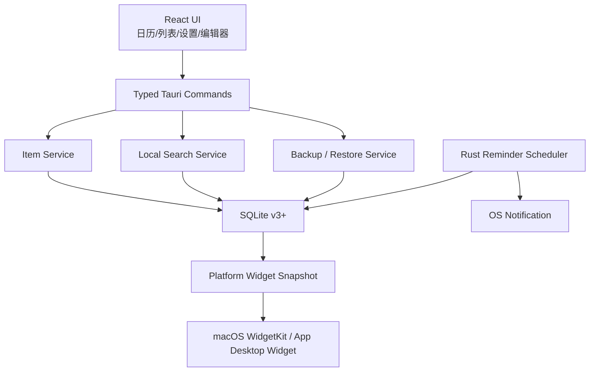

# BluNote v1.0 产品需求文档

| 项目 | 内容 |
|---|---|
| 目标版本 | v1.0 |
| 产品路线 | 本地个人效率优先，云能力在 v1.1+ 渐进引入 |
| 目标平台 | macOS、Windows、麒麟 OS/openKylin |
| 现状基线 | `main` v0.2.2，提交 `60cfd4168792b905107fb61e56bb0d5d671d8967` |
| 计划发布日期 | TBD |
| 文档状态 | Draft |

## 1. Executive Summary

### Problem Statement

BluNote v0.2.2 已能完成基础任务、会议和桌面挂件管理，但缺少事项编辑、重复任务、检索整理、可靠后台提醒和数据备份等个人效率产品的关键闭环。当前 macOS、Windows 能力不完全一致，麒麟 OS 尚未进入 `main` 正式产品范围，签名、公证和真机稳定性也未达到 v1.0 发布标准。

### Proposed Solution

v1.0 将 BluNote 建设为稳定、跨平台、本地优先的个人任务与会议中心：补齐任务全生命周期管理、重复计划、搜索分类、可靠提醒、备份恢复、三平台安装与升级，并保持现有简约桌面挂件体验。账号、云同步与团队协作不进入本期，以免牺牲本地体验和交付质量。

### Success Criteria

| 指标 | v1.0 验收值 | 测量方式 |
|---|---:|---|
| 冷启动时间 | p95 ≤ 2 秒 | 三平台基准设备，从启动到主界面可交互 |
| 稳定性 | 无崩溃会话 ≥ 99.5% | 发布测试与可选匿名崩溃统计；未启用遥测时使用受控长稳测试 |
| 提醒可靠性 | 常驻状态触达率 ≥ 99%；休眠恢复后 60 秒内补偿 | 1000 组跨平台自动化/真机场景 |
| 数据可靠性 | 升级、备份、恢复测试 100% 无事项丢失 | 固定数据集与故障注入测试 |
| 核心流程质量 | P0 验收用例通过率 100% | CI + 三平台手工矩阵 |
| 自动化覆盖 | 核心领域逻辑行覆盖率 ≥ 90% | Vitest、Rust 单元/集成测试 |
| 搜索性能 | 10,000 条事项下 p95 ≤ 200 ms | 本地基准测试 |

## 2. User Experience & Functionality

### User Personas

1. **桌面重度工作者**：长期使用电脑，希望待办常驻桌面，快速查看和完成事项。
2. **会议密集型用户**：需要统一管理会议、链接、地点和提醒，并从 ICS 导入日程。
3. **隐私敏感用户**：不愿注册账号或上传工作数据，希望离线使用和自主备份。
4. **多系统个人用户**：在 macOS、Windows 或麒麟 OS 上工作，希望核心交互和数据格式一致。

### User Stories

#### US-01 创建与编辑事项（P0）

As a 个人用户, I want to 随时创建和修改任务或会议 so that 计划变化时不必删除重建。

Acceptance Criteria:

- 任务和会议详情均提供编辑入口。
- 可修改标题、日期、时间、备注、地点、链接、提醒和子任务。
- 保存前沿用现有长度、时间关系和 URL 协议校验。
- 编辑保留 ID、来源和创建时间，只更新 `updatedAt`。
- 修改已触发提醒时间后，提醒状态重新计算；完成项默认不重新启用提醒。
- 放弃编辑时不写入数据库；存在未保存修改时关闭需二次确认。
- ICS 导入项可本地编辑，并显示“本地已修改”状态；再次导入不得静默覆盖本地修改。

#### US-02 重复任务与重复会议（P0）

As a 有固定节奏的用户, I want to 设置重复规则 so that 周期性工作无需反复创建。

Acceptance Criteria:

- 支持每天、工作日、每周、每月和自定义间隔。
- 支持永不结束、指定结束日期和指定次数。
- 完成当前实例后生成或激活下一实例，历史实例保持可追溯。
- 编辑时可选择“仅本次”或“本次及以后”；删除同样提供作用范围。
- 月末日期采用“当月最后有效日”策略，并在 UI 明示。
- 跨夏令时重复事项保持用户选择的本地墙上时间。
- 重复实例提醒不得重复触发或因应用重启丢失。

#### US-03 搜索、优先级与标签（P0）

As a 事项较多的用户, I want to 快速检索和分类 so that 能在数秒内找到目标事项。

Acceptance Criteria:

- 支持按标题、备注、地点和子任务文本搜索。
- 支持高、中、低、无四档优先级。
- 支持创建、重命名、删除标签；单事项可绑定多个标签。
- 支持按类型、完成状态、逾期状态、优先级、标签、日期范围组合筛选。
- 搜索词和筛选条件可一键清空，不默认跨会话保存。
- 10,000 条事项数据集下搜索 p95 ≤ 200 ms。
- 排序新增优先级选项，同时保留默认“未完成优先 + 时间升序”。

#### US-04 今日、即将到期与收件箱（P0）

As a 每日规划用户, I want to 从聚合视图看到最重要的事项 so that 不必逐日翻找。

Acceptance Criteria:

- 提供“收件箱”“今天”“未来 7 天”“已逾期”“已完成”入口。
- 未指定日期的任务进入收件箱；v0.2.2 任务迁移后日期保持不变。
- 今天视图包含今日任务、今日会议及已逾期未完成任务。
- 已完成视图默认按完成时间倒序，并支持恢复为未完成。
- 原有日历周/月视图继续保留。

#### US-05 可靠提醒（P0）

As a 依赖提醒的用户, I want to 在应用隐藏、重启或设备休眠后仍收到提醒 so that 不错过任务和会议。

Acceptance Criteria:

- 提醒调度迁移至 Rust 后台服务，不依赖 React 页面 30 秒轮询。
- 应用隐藏到托盘时提醒正常触发。
- 应用重启后重新加载所有未来提醒，已触发记录不重复发送。
- 设备从休眠恢复后，60 秒内补发仍有意义的提醒。
- 会议已结束的提醒不补发；任务提醒补发并明确标记“延迟提醒”。
- 快捷稍后继续支持 30 分钟、1 小时、明天 09:00、自定义。
- 默认保留每日最多 3 次限制，并允许用户在设置中选择 1–5 次。
- 通知权限被拒绝、系统勿扰或通知服务不可用时，在应用内显示可操作诊断。
- 时区变化、夏令时、系统时间回拨均有自动化测试。

#### US-06 数据备份、恢复与导出（P0）

As a 本地优先用户, I want to 自主备份和迁移数据 so that 更换设备或故障时不会丢失计划。

Acceptance Criteria:

- 支持导出完整 BluNote 备份，包含事项、子任务、标签、重复规则和偏好。
- 备份使用带版本号的 JSON 容器；不包含可执行内容。
- 支持导入备份并选择合并或覆盖。覆盖前必须创建自动恢复点并二次确认。
- 合并按稳定 ID 去重，冲突时展示双方更新时间并让用户选择。
- 支持导出 ICS；只导出可映射的会议与带日期任务。
- 导入前完成格式、大小、版本和字段长度校验。
- 损坏备份不能改变现有数据库。

#### US-07 三平台一致体验（P0）

As a 多系统用户, I want to 在 macOS、Windows 和麒麟 OS 获得一致核心体验 so that 切换设备时无需重新学习。

Acceptance Criteria:

- 三平台功能一致：事项 CRUD、日历、搜索筛选、重复规则、提醒、备份恢复、托盘、自启、透明度、拖动缩放。
- macOS 13+ 产出签名、公证 DMG；Windows 10 21H2+ 产出签名 NSIS；麒麟/openKylin 产出 x86_64/ARM64 DEB 与 AppImage。
- 安装包、应用内标题、托盘和通知统一使用 BluNote 最新图标与名称。
- X11 支持窗口定位、边缘吸附和桌面置底。
- Wayland 明确提示绝对定位/永久置底受合成器限制，不宣称无法保证的系统能力。
- Windows 和麒麟不复制 WidgetKit，而使用应用内桌面挂件提供相同任务查看与透明度体验。
- 平台专属功能必须在设置中标注，不得展示不可用开关。

#### US-08 桌面挂件与窗口体验（P0）

As a 桌面挂件用户, I want to 自由摆放且不会丢失窗口 so that 它能稳定融入工作桌面。

Acceptance Criteria:

- 鼠标拖动、八方向缩放、锁定、8 px 吸附和尺寸记忆保持可用。
- 分辨率、缩放比例、显示器数量变化后窗口自动回到可视工作区。
- 最小尺寸下所有核心操作可访问，无内容遮挡。
- 支持“恢复默认尺寸与位置”。
- 开机自启支持静默进入托盘，不抢占焦点。
- 桌面挂件、普通窗口和展开窗口的状态转换无闪烁、无尺寸越界。
- macOS WidgetKit 数据修改后 5 秒内请求刷新；小/中组件深链有效。

#### US-09 设置与首次使用引导（P1）

As a 新用户, I want to 理解窗口、提醒和数据策略 so that 能正确配置应用。

Acceptance Criteria:

- 首次启动用不超过 3 步说明拖动、桌面挂件、通知权限和本地存储。
- 独立设置页集中管理外观、窗口、提醒、自启、数据和关于信息。
- 显示应用版本、数据库位置、系统通知状态和当前平台能力。
- 所有设置支持恢复默认值；数据删除必须独立确认。
- 设置与核心流程满足键盘操作和屏幕阅读器标签要求。

#### US-10 升级与发布完整性（P0）

As a 已安装用户, I want to 安全升级 so that 新版本不会破坏数据或安装状态。

Acceptance Criteria:

- 每次数据库迁移均可从 v0.2.2 固定样本升级且数据数量、ID、内容一致。
- 迁移失败时保留原数据库并显示恢复指引。
- macOS、Windows 提供签名更新包；麒麟 DEB 支持覆盖升级，AppImage 保持数据目录兼容。
- CI 对每个平台验证安装包存在、架构、版本号、图标和基础元数据。
- 发布前完成冒烟安装、升级、卸载、数据保留和回滚测试。

### Functional Requirements Matrix

| ID | 需求 | 优先级 | v1.0 |
|---|---|---:|---:|
| FR-01 | 任务/会议完整 CRUD | P0 | 必须 |
| FR-02 | 重复规则与实例管理 | P0 | 必须 |
| FR-03 | 搜索、优先级、标签、组合筛选 | P0 | 必须 |
| FR-04 | 收件箱/今天/未来/逾期/完成聚合视图 | P0 | 必须 |
| FR-05 | Rust 后台提醒调度与恢复补偿 | P0 | 必须 |
| FR-06 | 完整备份、恢复、ICS 导入导出 | P0 | 必须 |
| FR-07 | macOS/Windows/麒麟正式构建 | P0 | 必须 |
| FR-08 | 窗口与桌面挂件可靠性 | P0 | 必须 |
| FR-09 | 设置中心与新手引导 | P1 | 应有 |
| FR-10 | 签名、公证、升级与回滚验证 | P0 | 必须 |

### Non-Goals

v1.0 明确不包含：

- 团队空间、任务指派、评论、审批、多人实时协作。
- 强制账号、云同步或服务端存储。
- AI 自动拆解任务、智能总结或自然语言代理。
- Apple EventKit、Microsoft Outlook/Exchange、企业 CalDAV 账户直连。
- 移动端、Web 正式版和浏览器扩展。
- Windows/macOS/麒麟无法共同实现的“完全相同系统原生小组件”。
- 甘特图、看板、工时、OKR 等项目管理套件能力。

## 3. AI System Requirements (If Applicable)

v1.0 不包含 AI 功能，因此无模型、提示词、推理服务或 AI 评测要求。搜索必须使用确定性的本地全文检索，不上传用户内容。

若 v1.1+ 引入 AI，必须采用独立 PRD，并至少定义：显式用户授权、本地/云端处理边界、内容脱敏、可关闭入口、成本上限、离线降级、幻觉评测和数据保留策略。

## 4. Technical Specifications

### Architecture Overview

延续现有 React + TypeScript + Tauri 2 + Rust + SQLite 架构，避免 v1.0 同时更换框架。关键调整是把提醒、迁移、备份和检索从 UI 生命周期中剥离到原生领域服务。

数据流原则：

1. UI 只提交经过前端校验的命令，不直接负责提醒调度。
2. Rust 再次执行安全校验，并在事务内写入 SQLite。
3. 写入成功后更新提醒队列和小组件快照。
4. 搜索、备份、恢复和迁移均以数据库为唯一事实源。

### Data Model Changes

建议将数据库升级为 v3+，保留原 JSON payload 兼容层，同时增加可索引字段：

| 实体/字段 | 用途 |
|---|---|
| Item `priority` | `none/low/medium/high` |
| Item `completed_at` | 已完成视图和恢复 |
| Item `local_modified` | ICS 导入冲突保护 |
| Tag / ItemTag | 标签与多对多关系 |
| RecurrenceRule | 频率、间隔、周几、结束条件、时区 |
| Reminder `scheduled_at/status` | 原生提醒队列、幂等触发 |
| Search index | 标题、备注、地点、子任务全文检索 |
| Backup metadata | 格式版本、创建时间、应用版本、校验摘要 |

迁移要求：

- 使用事务；升级前创建数据库副本。
- v0.2.2 的所有 ID、时间、提醒、来源和子任务无损保留。
- 任一步骤失败则回滚，不更新 `user_version`。
- 迁移必须可重复执行且不会产生重复标签、提醒或实例。

### Integration Points

| 集成点 | v1.0 方案 |
|---|---|
| SQLite | 本地唯一事实源，事务与版本迁移 |
| 系统通知 | macOS、Windows、Freedesktop/麒麟原生通知 |
| 开机自启 | Tauri autostart，支持静默参数闭环 |
| 系统托盘 | 三平台显示、锁定、退出和快速新增 |
| ICS | 本地文件导入/导出，不连接账户 |
| WidgetKit | macOS App Group 快照和深链 |
| 安装与更新 | DMG、NSIS、DEB、AppImage；签名策略按平台独立配置 |

### Platform Requirements

- macOS：最低 13.0；Apple Silicon 为主要发布架构，Intel 支持策略在发布计划中明确；WidgetKit 需正式 App Group、Developer ID、公证。
- Windows：最低 Windows 10 21H2；WebView2 安装/检测流程必须离线友好；安装包需 Authenticode。
- 麒麟/openKylin：提供 x86_64 与 ARM64；以 DEB 为正式安装格式、AppImage 为便携格式；X11 为完整桌面挂件基线，Wayland 采用能力检测和降级说明。

### Non-Functional Requirements

| 分类 | 要求 |
|---|---|
| 性能 | 冷启动 p95 ≤ 2 秒；10k 搜索 p95 ≤ 200 ms；普通操作反馈 ≤ 100 ms |
| 资源 | 挂件空闲 CPU 平均 < 1%；内存目标 ≤ 150 MB，最终门槛由三平台基准确认 |
| 稳定性 | 72 小时常驻长稳无崩溃、无重复提醒、无持续增长内存泄漏 |
| 离线 | 除更新检查外所有 P0 功能无网络可用 |
| 可访问性 | 核心流程全键盘可达；控件具备名称、状态和焦点；支持系统减少动态效果 |
| 本地化 | v1.0 简体中文完整；日期时间遵循系统时区和区域格式 |
| 兼容性 | 现有 v0.2.2 数据和偏好无损升级 |

### Security & Privacy

- 默认不创建账号、不上传任务内容、不启用遥测。
- 若加入崩溃统计，必须默认关闭或取得明确同意，并移除标题、备注、路径等内容字段。
- 备份文件仅由用户明确选择路径后写入；导入使用临时数据库验证后再事务合并。
- 继续限制 URL 为 HTTP/HTTPS，限制 ICS/备份大小和字段长度。
- Tauri CSP 和 capability 坚持最小权限；新增文件读写权限限制为用户选择的单一文件。
- 数据库、备份和日志不得记录通知正文之外的额外敏感内容。
- 发布依赖执行 npm audit、Cargo Audit、签名验证和 SBOM 生成。

### Test Strategy

1. **单元测试**：重复规则、时区、搜索、冲突合并、提醒状态机、数据库迁移。
2. **组件测试**：创建、编辑、筛选、设置、备份恢复错误态、键盘操作。
3. **Rust 集成测试**：事务回滚、原生调度、并发写入、损坏数据库与备份。
4. **端到端测试**：新装 → 创建 → 提醒 → 编辑 → 完成 → 备份 → 升级 → 恢复。
5. **平台真机测试**：睡眠唤醒、时区/DST、多显示器、系统缩放、通知拒绝、自启、托盘。
6. **安装测试**：三平台安装、覆盖升级、卸载、数据保留、签名和架构检查。
7. **性能测试**：1/1,000/10,000 条数据规模下启动、查询、内存和 CPU。

## 5. Risks & Roadmap

### Phased Rollout

#### Phase 1 — v0.3：个人效率闭环

- 事项编辑。
- 搜索、优先级、标签和聚合视图。
- 完整备份/恢复与 ICS 导出。
- 数据库 v3 迁移和自动恢复点。

退出标准：相关 P0 用例 100% 通过，v0.2.2 数据迁移无损。

#### Phase 2 — v0.7：提醒与重复规则

- Rust 原生提醒调度。
- 休眠、重启、时区变化补偿。
- 重复任务/会议及实例作用范围。
- 设置中心和诊断信息。

退出标准：1000 组提醒场景触达率 ≥ 99%，72 小时长稳通过。

#### Phase 3 — v0.9：三平台发布候选版

- 合入并稳定麒麟 x86_64/ARM64。
- 完成 macOS/Windows/麒麟平台差异处理。
- 签名、公证、安装、升级和回滚流程。
- 无障碍、性能和多显示器专项测试。

退出标准：三平台 CI 和真机阻断项清零，形成 RC 安装包。

#### Phase 4 — v1.0：稳定发布

- 仅修复 RC 缺陷，不增加范围。
- 完成用户文档、隐私说明、发布说明和支持矩阵。
- 灰度发布后观察稳定性，再扩大分发。

退出标准：所有 Success Criteria 达标，无 P0/P1 已知缺陷。

#### v1.1+：可选云能力

- 可选账号和端到端加密个人同步。
- 冲突可视化与设备管理。
- 系统日历账户直连评估。
- 团队协作仍需独立立项，不由个人同步自然扩展。

### Technical Risks

| 风险 | 概率/影响 | 缓解方案 |
|---|---|---|
| 三平台通知 API 行为不一致 | 高/高 | 统一领域状态机，平台适配器分层，真机矩阵和延迟补偿 |
| 重复规则与 DST 产生错期 | 中/高 | 保存原始时区与本地墙上时间，建立边界日期测试集 |
| v0.2.2 JSON payload 难以高效检索 | 高/中 | 增加规范化索引/FTS，保留 payload 作为兼容快照 |
| 数据迁移导致丢失或重复 | 低/高 | 事务、迁移前副本、幂等脚本、固定样本和故障注入 |
| Wayland 限制桌面置底和绝对定位 | 高/中 | 能力检测、明确提示、X11 完整支持，不作虚假承诺 |
| 签名、公证和证书延误 | 中/高 | v0.9 前准备账号证书，CI 预留签名与无签名双路径 |
| AppImage 基线系统影响兼容性 | 中/中 | 使用兼容基线原生 runner 构建，x86_64/ARM64 分别验证 |
| 范围膨胀到云和团队协作 | 中/高 | 坚守 Non-Goals，云能力只进入 v1.1+ 独立评审 |
| 无遥测导致线上稳定性难量化 | 中/中 | v1.0 使用受控长稳与可选隐私安全崩溃统计，禁止内容采集 |

### Dependencies and Open Decisions

| 项目 | 状态 |
|---|---|
| v1.0 发布日期 | TBD |
| macOS Intel 是否继续正式支持 | TBD |
| Windows 自动更新渠道 | TBD |
| 麒麟目标发行版与版本矩阵 | 需确定具体 V10/openKylin 版本 |
| 崩溃统计是否启用 | 默认不启用，需隐私评审 |
| AppImage 是否作为正式渠道 | 建议便携/测试渠道，DEB 为麒麟正式渠道 |
| 每日稍后提醒默认上限 | 暂沿用 3 次，可在 1–5 次中配置 |

### Release Gate

以下任一项未满足，不得发布 v1.0：

1. P0 验收用例、迁移、备份恢复和提醒可靠性未达到 Success Criteria。
2. 任一平台存在可复现数据丢失、重复提醒、窗口不可恢复或安装失败。
3. macOS 未完成签名公证、Windows 未完成签名、麒麟包未通过架构和依赖校验。
4. 存在高危依赖漏洞或超出最小权限的 Tauri capability。
5. 用户文档、隐私说明、升级/回滚指引和已知限制未完成。
